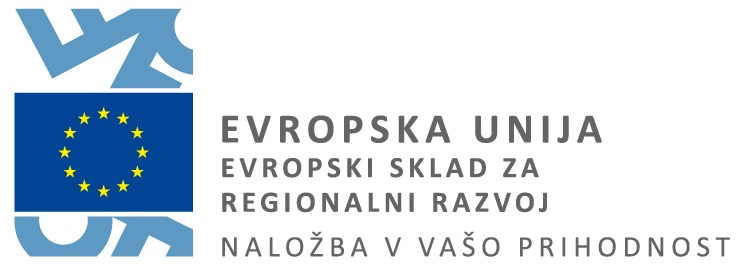

# Slovene BERT/RoBERTa training tool
V tem repozitoriju se nahaja rezultat aktivnosti A3.3 - R3.3.2 Orodje za izračun slovenskih kontekstnih vložitev, ki je nastalo v okviru projekta [Razvoj slovenščine v digitalnem okolju](https://www.cjvt.si/rsdo/).

---

Scripts for data-preparation and training of Slovenian BERT/RoBERTa model.

### Requirements
* `fairseq` (https://github.com/pytorch/fairseq)
* `sentencepiece` (https://github.com/google/sentencepiece)
* `onion` (http://corpus.tools/wiki/Onion)

### Preprocess corpora
There are a few scripts for simple preprocessing of some corpora (KAS, siParl, JANES, slWaC) in `.vert` format in `preprocess_corpora` folder. Fix the paths to files in the `.sh` scripts and run them first. 

Then merge all corpora files into one file (eg. with `cat`) and deduplicate it with `onion_deduplicate.sh`. Reformat the text from `.vert` format to simple `.txt` with `vert2bert.py`. Finally, split the corpus into train, eval and test parts with `split_corpus.py`.

Optionally: prepare a subset of a corpus, to be used for vocabulary creation/sentencepiece model training in the next step. Run `split_corpus.py` with options `--eval=0 --test=0 --train=0.067` and a different output prefix, indicating this split is to be used for sentencepiece model only. Originally 1/15th of total corpus was used for this, but a different size of a subset is equally valid.

### Create train data
First train a sentencepiece model, which is used as subword tokenizer. Run `train_sentencepiece_model.sh` specifying the corpora used for training the sentencepiece model. Then encode and binarize the raw text corpus using the newly trained sentencepiece model. Run `encode-binarize-corpus.sh` (change paths to train, eval and test splits of the corpus in the script).

## Train the model
The scripts in `training` show how the training was done on DGXA100 machine with Slurm installed. First, we create an nvidia enroot container, by running `create_container.sh`. The training data (`.bin` and `.idx` files) are assumed to be in the folder `sl/sl_roberta_preprocessed`. Create a `sl/checkpoints` folder as well, to save training checkpoints to. Run the training with `sl_roberta_train_dgxa100.sh`.

> Operacijo Razvoj slovenščine v digitalnem okolju sofinancirata Republika Slovenija in Evropska unija iz Evropskega sklada za regionalni razvoj. Operacija se izvaja v okviru Operativnega programa za izvajanje evropske kohezijske politike v obdobju 2014-2020.

